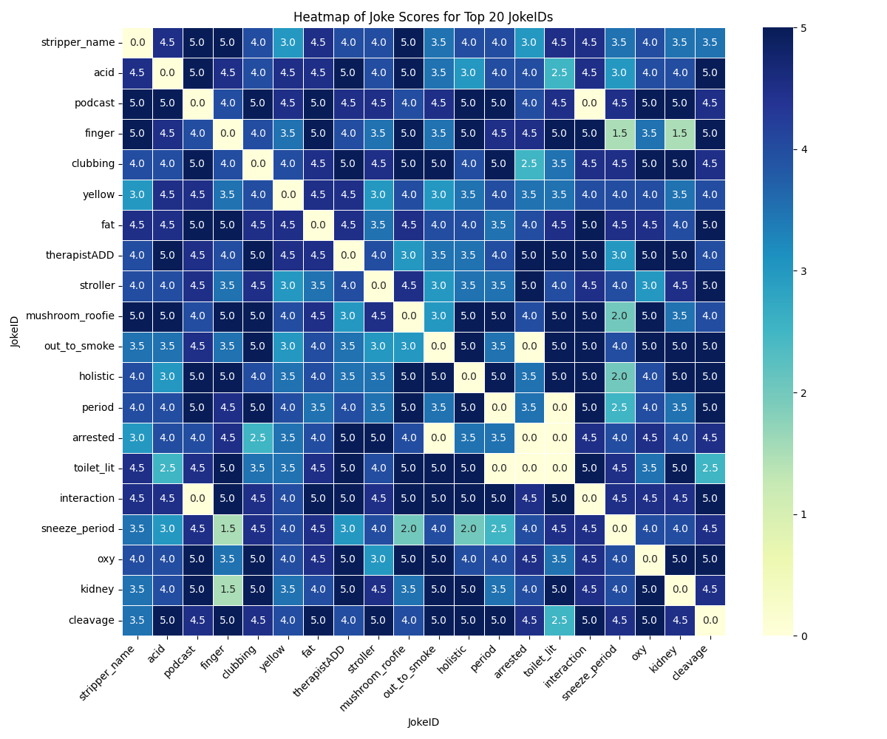
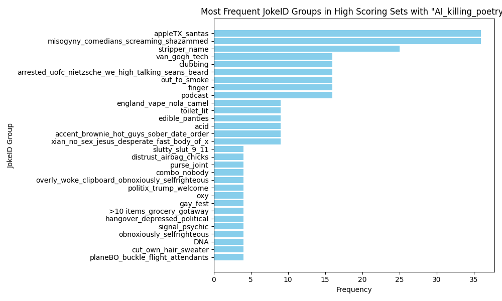
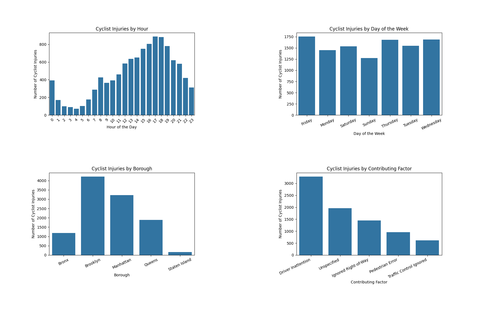

# analytics_fun
## sandbox for playing with various datasets

### which jokes score highest when paired together in the same set

<video width="340" height="280" controls autoplay>
  <source src="vista.mp4" type="video/mp4">
  Your browser does not support the video tag.
</video>

  
  

### cycling data assessing when and where cyclists are most likely to get injured

  

