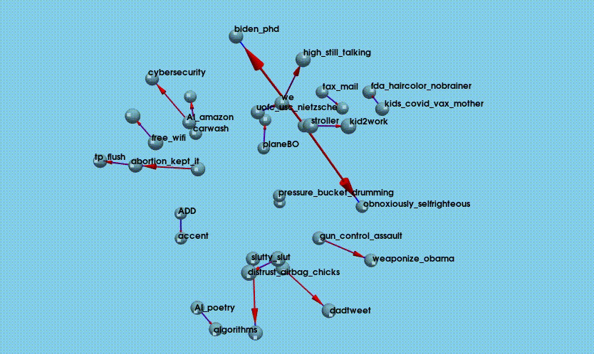

# analytics_fun
## sandbox for playing with various datasets

### joke pairing data

view best joke to precede another
```python
> pyviz_joke_stats.py`
```

show heatmap of average score for pairings of the top 20 (highest scoring) jokes  
```python
> python top_20.py 
```
<div style="display: flex; justify-content: space-between;">
  
</div>

call with a specific joke to determine best set options
```python
> python joke_stats.py AI_killing_poetry
```
<div style="display: flex; justify-content: space-between;">
  
</div>


### cycling data assessing when and where cyclists are most likely to get injured

<div style="display: flex; justify-content: space-between;">
  
</div>
